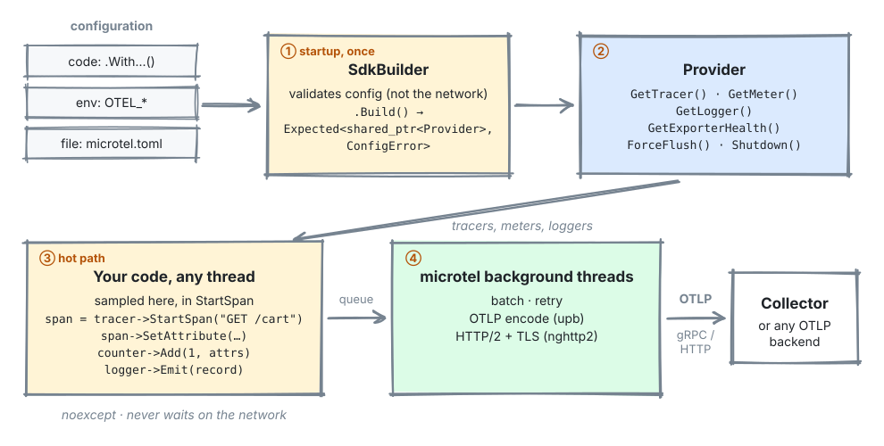
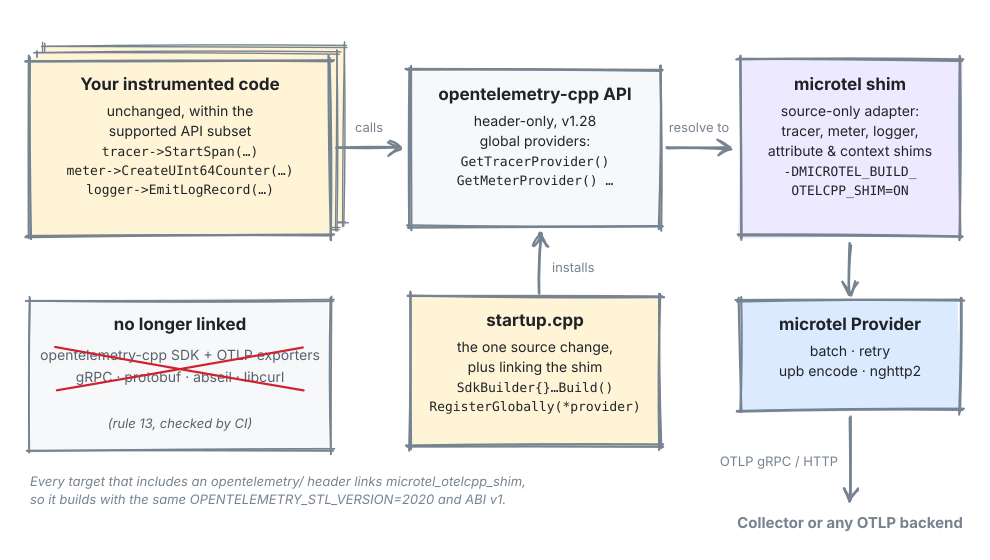
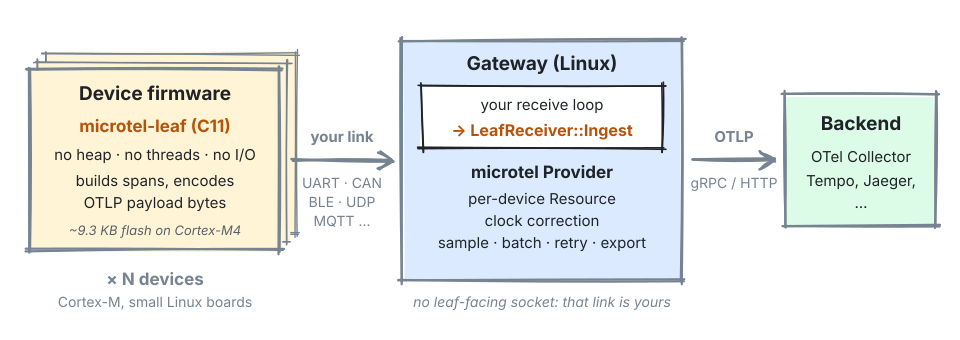

# microtel

An OpenTelemetry-compatible trace runtime and OTLP exporter for C++20. It
speaks OTLP/gRPC and OTLP/HTTP-protobuf without linking gRPC, abseil or the
protobuf C++ runtime.

[](LICENSE)
[](https://github.com/chanderraja/microtel/actions)

microtel covers the part of the OpenTelemetry tracing SDK that applications
use day to day: tracers, spans, context, W3C propagation, samplers, a batch
processor and resources, plus an OTLP exporter. Both OTLP protocols run over a
single nghttp2 HTTP/2 transport. The gRPC side is a small unary-RPC layer on
that transport, so picking gRPC over HTTP costs nothing extra in binary size.
In the project's benchmark against opentelemetry-cpp it starts a span about
**4× faster** and sustains roughly **twice the throughput**;
[Performance](#performance) has the full comparison and its caveats.

## Who is this for?

- **You're writing new C++ code.** Run the no-collector example in
  [Try it in five minutes](#try-it-in-five-minutes), then follow
  [Getting started](#getting-started) to install microtel and send your first
  span. [`examples/`](examples/README.md) has a runnable program per feature.
- **You're migrating from opentelemetry-cpp.** An experimental API shim routes
  existing `opentelemetry-cpp` call sites to microtel for a documented subset
  of the API. It is **not yet a drop-in replacement**: read the
  [shim caveats](#how-you-use-it) and the
  [migration guide](docs/migration-from-otel-cpp.md) before you start.
- **You're tracing microcontrollers or other constrained devices.**
  microtel-leaf (experimental) is a C11 library with no heap, and a microtel
  gateway forwards its spans to your collector. Start with
  [the leaf overview](#leaf-and-concentrator-tracing-for-microcontrollers),
  then [`leaf/README.md`](leaf/README.md) and the
  [`examples/leaf/`](examples/leaf/) and [`examples/leaf_mqtt/`](examples/leaf_mqtt/)
  examples.

**Documentation:** [docs/README.md](docs/README.md) is the index of every
document, grouped by audience. If something fails, start at
[troubleshooting](docs/troubleshooting.md).

## Try it in five minutes

The first path needs nothing running and prints its spans to the terminal.
The other two export to a local collector, Tempo and Grafana stack (Docker or
Podman) and end with a trace at <http://localhost:3000>. Tests are off, so the
build compiles only what the examples need. Start from a checkout:

```bash
git clone https://github.com/chanderraja/microtel.git && cd microtel
```

**No collector, no containers:**

```bash
cmake -S . -B build -DMICROTEL_BUILD_TESTS=OFF -DMICROTEL_BUILD_EXAMPLES=ON
cmake --build build -j"$(nproc)"
./build/examples/microtel_example_console_trace   # prints the spans it exported
```

[`examples/console_trace/`](examples/console_trace/) shows the output and how
it works: the real pipeline, with the last hop swapped for a transport that
prints.

**C++ tracing:**

```bash
examples/stack/up.sh
cmake -S . -B build -DMICROTEL_BUILD_TESTS=OFF -DMICROTEL_BUILD_EXAMPLES=ON
cmake --build build -j"$(nproc)"
./build/examples/microtel_example_basic_trace     # prints the trace ID
```

**A leaf device and its gateway:**

```bash
examples/stack/up.sh
cmake -S . -B build -DMICROTEL_BUILD_TESTS=OFF -DMICROTEL_BUILD_EXAMPLES=ON \
      -DMICROTEL_BUILD_LEAF=ON -DMICROTEL_WITH_CONCENTRATOR=ON
cmake --build build -j"$(nproc)"
./build/examples/microtel_example_leaf_concentrator &   # the gateway, UDP :9310
./build/examples/microtel_example_leaf_udp_leaf         # a leaf; sends five payloads
```

You'll need a C++20 compiler, CMake 3.20+ and the OpenSSL, nghttp2 and zlib
development packages ([Getting started](#getting-started) has the install
lines). [`examples/`](examples/) explains each program and what to look for
in Grafana.

## Why it exists

`opentelemetry-cpp` with the OTLP/gRPC exporter brings in gRPC, abseil,
protobuf, c-ares and re2, which is megabytes of transitive dependencies and a
long build. For edge, embedded, air-gapped and CNF deployments that is often
enough to rule it out.

On the wire, gRPC is a thin layer over HTTP/2: a 5-byte length prefix, a few
headers, and a trailer carrying `grpc-status`. OTLP needs nothing else from
the gRPC library, so microtel implements just the wire protocol.

The runtime dependency closure is:

| Dependency | Purpose |
|---|---|
| nghttp2 | HTTP/2 transport for both OTLP protocols |
| OpenSSL | TLS and mTLS |
| zlib | gzip request compression and response decompression |
| upb (vendored, symbols renamed to `microtel_upb_*`) | OTLP protobuf encoding |
| spdlog (optional) | internal diagnostic log sink |

A CI symbol scan fails any PR whose shipped archives define or reference an
`absl::`, `grpc` or `google::protobuf::` symbol. Adding a runtime dependency
requires an [ICP](docs/icps/).

## Status

The current release is **v1.2.0**, and the project follows SemVer.
[SECURITY.md](SECURITY.md) lists which versions get fixes.

| Area | Status |
|---|---|
| Traces | Supported. `Tracer` and `Span`; `StartAsCurrentSpan` with a thread-local context; W3C `traceparent`, `tracestate` and `baggage` inject/extract; head samplers (always on/off, trace-ID ratio, parent-based) and composable rule chains; batch span processor; process and host resource detectors; `HealthSnapshot` drop and queue counters. |
| Operations | Supported since v1.1. Runtime setters on `Provider` (`SetBatchOptions`, `SetSamplerRatio`, `SetMetricInterval`, `SetLogLevel`); several named providers in one process via `GetProvider(name)`; static headers and a `WithAuthProvider` callback; TLS, custom CA and mTLS; gzip; the `microtel::sugar` convenience layer. |
| Metrics | Implemented but experimental: all seven instruments, periodic reader, temporality, cardinality limits, views and exemplars. Scheduled to become supported in v1.3. Until then there is no compatibility guarantee and no conformance coverage. |
| Logs | Supported since v1.2: `Logger` and `LogRecord`, OTLP export over both protocols with retry, automatic trace/span correlation, conformance-tested against the collector, and bridges for spdlog, glog and log4cxx. |
| Leaf / concentrator | New in v1.2, experimental and off by default. A C11 leaf library for microcontrollers (about 9.3 KB of flash, no heap) and a `LeafReceiver` that turns a microtel process into a gateway for them; see [Leaf and concentrator](#leaf-and-concentrator-tracing-for-microcontrollers). Traces only. The C API may change in any 1.x minor. |
| Custom export transport | Experimental. `SdkBuilder::WithExportTransport` sends a full C++ Provider's OTLP requests through your own link (UART, CAN, UDP, MQTT…) instead of HTTP/2, for example to a concentrator. See [ICP 0036](docs/icps/0036-custom-export-transport.md). |
| opentelemetry-cpp API shim | Experimental, source-only and off by default. Routes existing `opentelemetry-cpp` API call sites to microtel for a documented subset of the API; **not yet a drop-in replacement** (see [How you use it](#how-you-use-it) and [migration-from-otel-cpp.md](docs/migration-from-otel-cpp.md)). |

Not supported: plaintext OTLP/HTTP to an HTTP/1.1-only receiver (see
[Protocols and endpoints](#protocols-and-endpoints)), HTTP proxies, TLS below
1.2, and Windows. The [compatibility matrix](docs/compatibility-matrix.md) has
the full list, and [microtel-roadmap.md](microtel-roadmap.md) has what's next.

## How you use it

**New code: the microtel C++ API.** Build a `Provider` once at startup from
code, environment and an optional TOML file, then get tracers, meters and
loggers from it. Recording is `noexcept` and never waits on the network;
microtel's own threads batch, encode and send. [Getting started](#getting-started)
walks through it.

<p align="center">
  
</p>

**Existing opentelemetry-cpp code: the shim (experimental).** Call sites that
stay within the shim's supported subset of the `opentelemetry-cpp` API keep
working unchanged. You change one startup file to build a microtel `Provider`
and call `RegisterGlobally`, change your build to link the shim instead of
opentelemetry-cpp's SDK and exporters, and the gRPC, protobuf and abseil
dependencies leave your link.

> [!WARNING]
> **The shim is not yet a drop-in replacement for opentelemetry-cpp.** It
> covers traces, metrics and logs against the opentelemetry-cpp API (v1.28,
> ABI v1), but:
>
> - **Not available:** synchronous gauges (`CreateInt64Gauge` /
>   `CreateDoubleGauge`) and `Span::AddLink()` after start (both ABI v2),
>   bound instruments (`Counter::Bind()`), opentelemetry-cpp's YAML
>   configuration file, and per-signal `OTEL_EXPORTER_OTLP_<SIGNAL>_*`
>   variables (ignored).
> - **Converted or dropped:** a `uint64` attribute above `INT64_MAX` becomes
>   a decimal string and a `uint64` measurement above it is dropped; byte-array
>   attributes become hex strings; `schema_url` on `GetTracer` and `GetLogger`,
>   logger attributes and numeric log event ids are dropped.
> - **Behaves differently:** closing a tracer shuts down the whole provider,
>   and a plaintext `http://…:4318` endpoint won't work because microtel
>   speaks only HTTP/2.
> - **Build:** every target that includes an `opentelemetry/` header must link
>   `microtel_otelcpp_shim` so it is compiled with the same opentelemetry-cpp
>   ABI settings; a mismatch shows up as link errors, not a clear message.
>
> It is tested end to end against the wire, but not yet against real-world
> applications; that and a frozen API surface are the gates for beta.
> [migration-from-otel-cpp.md](docs/migration-from-otel-cpp.md) lists every
> difference with the test behind it.

<p align="center">
  
</p>

## Getting started

microtel runs on Linux only (the I/O thread uses `epoll`); CI builds it as
C++20 and C++23 with GCC 13 and Clang 18 on Ubuntu x86_64. You need a C++20
compiler, CMake 3.20 or newer, `pkg-config`, and the OpenSSL, nghttp2 and zlib
development packages:

```bash
# Debian / Ubuntu
sudo apt-get install -y cmake ninja-build pkg-config libssl-dev libnghttp2-dev zlib1g-dev
# Fedora / RHEL
sudo dnf install -y cmake ninja-build pkgconf-pkg-config openssl-devel libnghttp2-devel zlib-devel
```

Get the latest release, then build and install it under your home directory,
which needs no `sudo`:

```bash
git clone --branch v1.2.0 https://github.com/chanderraja/microtel.git
cd microtel
cmake -S . -B build -DCMAKE_BUILD_TYPE=Release -DMICROTEL_BUILD_TESTS=OFF
cmake --build build -j"$(nproc)"
cmake --install build --prefix "$HOME/.local/microtel"
```

Configuring fetches toml++ and spdlog (unless `-DMICROTEL_USE_SPDLOG=OFF`),
plus GoogleTest when tests are on. To use installed copies instead and build
offline, as a package manager does, add `-DMICROTEL_USE_SYSTEM_DEPS=ON`.
None of them end up in the installed package's link closure: toml++ is
always compiled header-only into microtel, even when the installed toml++ is
a library. The install puts the headers,
the static archives, the CMake package and the `microtel-preflight` tool under
the prefix. For a system-wide install, use a prefix such as `/opt/microtel`
and run that last command with `sudo`.

Then, in your application's directory, a `CMakeLists.txt` that finds the
installed package:

```cmake
cmake_minimum_required(VERSION 3.20)
project(my_app LANGUAGES CXX)
set(CMAKE_CXX_STANDARD 20)
set(CMAKE_CXX_STANDARD_REQUIRED ON)

find_package(microtel 1.1 REQUIRED CONFIG)
add_executable(my_app main.cpp)
target_link_libraries(my_app PRIVATE microtel::microtel)
```

Point CMake at the install prefix when you configure:

```bash
cmake -S . -B build -DCMAKE_PREFIX_PATH="$HOME/.local/microtel"
cmake --build build
```

Link against `microtel::microtel` only. The per-layer targets
(`microtel::sdk`, `microtel::transport` and so on) are exported because a
static link needs them, but they can change without notice
([ICP 0020](docs/icps/0020-install-and-package-config.md)). Your link line
also needs zlib, OpenSSL and libnghttp2; `find_package(microtel)` locates
them (nghttp2 through pkg-config) as private dependencies, so they add no
include paths or definitions to your targets.

A minimal `main.cpp` that sends one span to a local collector:

```cpp
#include <microtel/provider.hpp>
#include <microtel/sdk_builder.hpp>
#include <microtel/span.hpp>
#include <microtel/tracer.hpp>

#include <chrono>
#include <cstdint>
#include <iostream>
#include <string>

int main()
{
    // Build() returns microtel::Expected<std::shared_ptr<Provider>, ConfigError>.
    auto built = microtel::SdkBuilder{}
                     .WithEndpoint("http://localhost:4317")  // OTLP/gRPC, plaintext h2c
                     .WithProtocol(microtel::Protocol::Grpc)
                     .WithServiceName("checkout")
                     .WithServiceVersion("1.4.2")
                     .Build();
    if (!built)
    {
        std::cerr << "microtel: " << built.error().message << '\n';
        return 1;
    }
    const auto provider = *built;
    const auto tracer = provider->GetTracer("checkout.http", "1.4.2");

    {
        const auto span = tracer->StartSpan("GET /cart");
        span->SetAttribute("http.request.method", std::string{"GET"});
        span->SetAttribute("http.response.status_code", std::int64_t{200});
        span->SetStatus(microtel::StatusCode::Ok);
    }  // The span ends here and the batch processor exports it in the background.

    const microtel::Status flushed = provider->ForceFlush(std::chrono::seconds{5});
    // Completed means the queue drained; a batch the collector rejected also drains.
    const bool delivered =
        flushed == microtel::Status::Completed && provider->GetExporterHealth().batches_failed == 0;
    const microtel::Status shut = provider->Shutdown(std::chrono::seconds{5});
    return (delivered && shut == microtel::Status::Completed) ? 0 : 2;
}
```

The API does not throw. `StartSpan`, `SetAttribute`, `AddEvent` and `End` are
`noexcept`; on failure they drop the data and count the drop in
`Provider::GetExporterHealth()`. Initialization returns `microtel::Expected`
(`std::expected` on C++23, a vendored `tl::expected` on C++20), and
`ForceFlush`/`Shutdown` return a `microtel::Status` of `Completed`,
`TimedOut`, `AlreadyShutDown` or `Failed`. `Completed` is not a delivery
receipt: it means the queue drained, which is also true when the collector
rejected a batch. `GetExporterHealth().batches_failed` and
`last_error_message` say whether one was rejected.

Nothing touches the network until the first export. Call
`provider->Connect()` if you want a bad endpoint reported at startup. A span
without an explicit `StartSpanOptions{.parent = ...}` takes its parent from
the current context, which `StartAsCurrentSpan` sets for the lifetime of the
returned scope.

Metrics use the same provider. Attributes are a
`std::span<const microtel::KeyValue>`, and a braced list won't convert to one
in C++20, so keep them in a named container:

```cpp
#include <microtel/meter.hpp>
#include <array>

// SdkBuilder can also take .WithMetricInterval(std::chrono::seconds{60})
// and .WithMetricLimits({.max_cardinality = 2000}).
const auto meter = provider->GetMeter("checkout.http", "1.4.2");
const auto requests = meter->CreateCounter<std::int64_t>("http.server.requests");
const auto latency = meter->CreateHistogram<double>("http.server.duration", "", "ms");

const std::array<microtel::KeyValue, 2> attrs{{
    {.key = "http.request.method", .value = std::string{"GET"}},
    {.key = "http.response.status_code", .value = std::int64_t{200}},
}};
requests->Add(1, attrs);
latency->Record(4.2, attrs);
```

## Leaf and concentrator: tracing for microcontrollers

microtel also traces devices too small to run any OpenTelemetry SDK. **microtel-leaf**
is a C11 library that emits OTLP spans from a microcontroller. On a Cortex-M4
it adds about 9.3 KB of flash to the firmware image and needs 512 bytes of RAM
you allocate, about 3.4 KB of stack at its deepest call, and no heap. A
microtel **concentrator** on a nearby gateway exports the spans to your
collector.

A sensor node, a motor controller or a BLE tag usually can't run an
OpenTelemetry SDK. It has kilobytes of RAM, no heap, no threads, no TLS and
often no IP route to a collector, so its work never shows up in the traces of
the system around it. microtel splits the job in two:

<p align="center">
  
</p>

The leaf builds spans in memory the caller owns and encodes them as a
standard OTLP `ExportTraceServiceRequest`. The concentrator is an ordinary
microtel `Provider` on the gateway: it ingests those bytes from whatever link
the devices already speak and exports every device's spans to your collector.
[How the leaf and concentrator fit together](leaf/README.md#how-the-leaf-and-concentrator-fit-together)
has the details.

Footprint of a minimal trace-only leaf (one span, one attribute, streamed),
from [docs/bench-results/leaf-footprint.md](docs/bench-results/leaf-footprint.md),
which CI measures on every PR:

| | nanopb backend (default) | upb backend |
|---|---|---|
| Flash, Cortex-M4 / Cortex-M0+ | **9.3 KB / 9.5 KB** | 14.4 KB / 14.6 KB |
| Leaf static RAM on Cortex-M | **0 bytes** | 65 bytes |
| Caller-owned RAM | **512 bytes** (256 state + 256 record buffer) | 2.5 KB (adds 2 KiB encode scratch) |
| Worst-case stack, encode, Cortex-M4 | 3.4 KB | 2.9 KB |
| Heap | never (CI rejects any `malloc` reference) | only without `config.scratch` |
| Good fit for | microcontrollers | Linux-class boards |

On the device, in C:

```c
static microtel_leaf_t g_leaf;        /* 256 bytes of opaque state */
static uint8_t g_records[256];        /* spans live here until encoded */

microtel_leaf_init(&g_leaf, sizeof g_leaf, &config, g_records, sizeof g_records);

microtel_leaf_span_t span;
microtel_leaf_span_start(&g_leaf, &span, "sensor.read", 11, MICROTEL_LEAF_SPAN_KIND_CLIENT, NULL);
microtel_leaf_span_set_attribute(&g_leaf, span, &reading);
microtel_leaf_span_end(&g_leaf, span);

microtel_leaf_encode(&g_leaf, frame, sizeof frame, &written);  /* or stream with encode_to */
uart_send(frame, written);                                     /* your link, not ours */
```

[`leaf/README.md`](leaf/README.md) covers the rest: the gateway code,
per-device settings and time modes, building with just a C11 cross-compiler,
and choosing an encoder backend. [docs/leaf-concentrator-design.md](docs/leaf-concentrator-design.md)
has the design, and [`examples/leaf/`](examples/leaf/) (UDP) and
[`examples/leaf_mqtt/`](examples/leaf_mqtt/) (MQTT) run devices and a
concentrator into the bundled collector, Tempo and Grafana stack.

**The leaf and concentrator are experimental in v1.2:** traces only, off by
default, and the C API may change in any 1.x minor. The roadmap stabilises the
API in v2.0 and adds reference ports for STM32 HAL, Zephyr and FreeRTOS in
v2.1.

## Examples

[`examples/`](examples/) has runnable programs and a collector, Tempo and
Grafana stack that runs under Docker or Podman; [Try it in five
minutes](#try-it-in-five-minutes) builds and runs them.
[`examples/README.md`](examples/README.md) lists every example and what it
shows, from basic tracing, context propagation and sampler chains to TLS,
auth, logs and the experimental leaf examples.

## Protocols and endpoints

The transport only speaks HTTP/2. Against a stock OpenTelemetry Collector, use
OTLP/gRPC on `:4317` (`grpc://`, `grpcs://`, or `http://` / `https://` with
`Protocol::Grpc`) or OTLP/HTTP over TLS on `https://host:4318`. Plaintext
`http://host:4318` does not work there: the collector's plaintext `:4318`
receiver is HTTP/1.1 only. microtel reports the mismatch as a `Build()`
warning, a `Connect()` error, and in `HealthSnapshot::last_error_message`.
Section 4 of the [compatibility matrix](docs/compatibility-matrix.md) has
the full table of endpoints and what works instead, and
[configuration.md](docs/configuration.md) §3.3 how each endpoint scheme
selects the protocol.

## Configuration

Each setting is resolved separately, highest precedence first: code
(`SdkBuilder::With*`), environment variables, a TOML file passed to
`SdkBuilder::FromFile(path)`, then built-in defaults. A value set in code can't
be overridden from the environment. microtel never searches for a config file
on its own. The standard `OTEL_EXPORTER_OTLP_*`, `OTEL_SERVICE_NAME` and
`OTEL_RESOURCE_ATTRIBUTES` variables work; some `OTEL_*` variables are
ignored, including the per-signal endpoints, `OTEL_TRACES_SAMPLER` and
`OTEL_BSP_*`. [docs/configuration.md](docs/configuration.md) has every
setting with its environment variable, TOML key and default.

`microtel-preflight --preflight={connect|export} [config.toml]` resolves a
configuration the same way the SDK does and then attempts a real connection
or export, which is a quick way to check a deployment before it goes live.
`--preflight=export` exits 0 only if the span was exported and the collector
accepted it; a rejected batch exits 3 with the collector's error.

## Build options

The defaults build the library and its tests. The options you are most likely
to set are `-DMICROTEL_BUILD_TESTS=OFF` for an install-only or cross build,
`-DMICROTEL_BUILD_EXAMPLES=ON`, `-DMICROTEL_USE_SYSTEM_DEPS=ON` for offline
and package-manager builds, and the experimental `MICROTEL_BUILD_LEAF`,
`MICROTEL_WITH_CONCENTRATOR` and `MICROTEL_BUILD_OTELCPP_SHIM`.
[docs/build-options.md](docs/build-options.md) lists every option with its
default and effect.

## Performance

In the project's benchmark against opentelemetry-cpp on the same host,
microtel starts a span about **4× faster** at the median (about 6× at p95),
sustains roughly **twice the span throughput**, and its benchmark binary is
about **2.5× smaller** than one using opentelemetry-cpp's OTLP/gRPC exporter.
opentelemetry-cpp flushes somewhat faster.

Those figures come from hot-loop traces with a blackhole sink (no network) on
one host. [docs/bench-results/](docs/bench-results/README.md) has the summary
table, the committed snapshot it is read off, the method and how to reproduce
it; the leaf's flash, RAM and stack are in
[docs/bench-results/leaf-footprint.md](docs/bench-results/leaf-footprint.md).

## Documentation

**[Full documentation index](docs/README.md)**: every document, grouped into
using microtel, microcontrollers (the leaf), and contributing and design.

**[Troubleshooting](docs/troubleshooting.md)**: an error message, warning,
health counter or exit code, and what to do about it.

Highlights for users: [configuration](docs/configuration.md),
[compatibility matrix](docs/compatibility-matrix.md),
[interop matrix](docs/interop-matrix.md) (tested collectors and backends),
[auth callback recipes](docs/auth-callback-recipes.md) (OAuth2 and AWS SigV4),
[migrating from opentelemetry-cpp](docs/migration-from-otel-cpp.md), the
[leaf library](leaf/README.md) and [leaf footprint](docs/bench-results/leaf-footprint.md), and the
[error](docs/error-model.md), [threading](docs/threading-model.md) and
[memory](docs/memory-model.md) models.

Highlights for contributors: the [specification](microtel-spec.md), the
[roadmap](microtel-roadmap.md), [architecture](docs/architecture.md), the
locked [interface contracts](docs/interfaces.md),
[metrics design](docs/metrics-design.md),
[leaf / concentrator design](docs/leaf-concentrator-design.md), the [ICPs](docs/icps/) that record
design decisions, and the rest of [docs/](docs/README.md) (coding standards, sequence
diagrams).

## Contributing

Read [CONTRIBUTING.md](CONTRIBUTING.md) first; it covers the TDD gates and
the interface-change process. [docs/development.md](docs/development.md) maps
each source directory to its owner. AI coding agents should also read
[CLAUDE.md](CLAUDE.md). To build and test from a checkout:

```bash
cmake -S . -B build -DMICROTEL_BUILD_TESTS=ON
cmake --build build -j"$(nproc)"
ctest --test-dir build --output-on-failure
```

Report vulnerabilities privately as described in [SECURITY.md](SECURITY.md).
The release procedure is in [RELEASING.md](RELEASING.md).

## License

Apache 2.0, the same as the OpenTelemetry ecosystem. It carries an explicit
patent grant, which matters for protocol-implementing code. See
[LICENSE](LICENSE), [NOTICE](NOTICE) and
[THIRD_PARTY_NOTICES.md](THIRD_PARTY_NOTICES.md).
